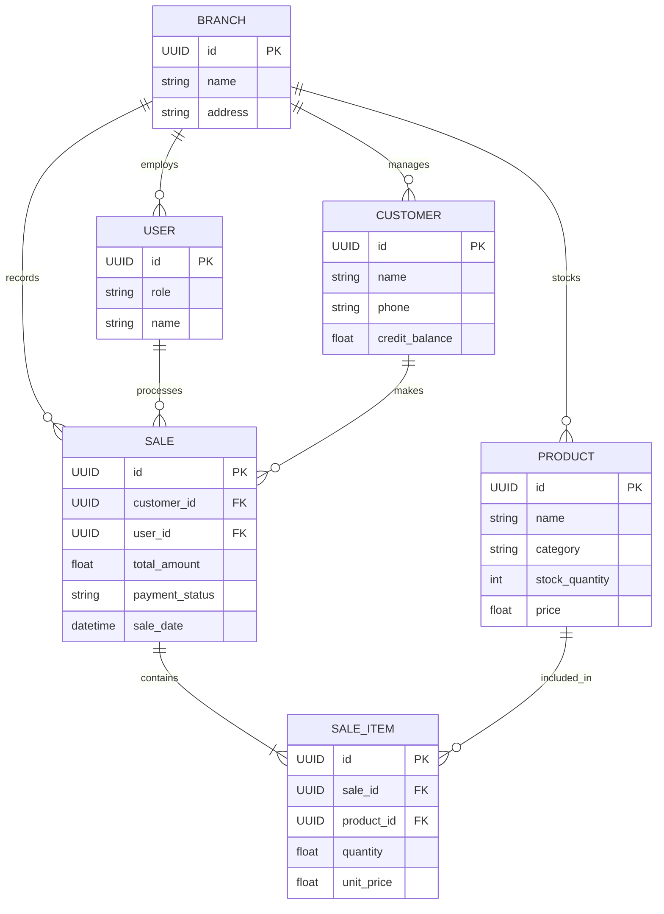

# Ramest Krishi Sewa Kendra - Architecture & Implementation Plan

Welcome to the architectural design document for **Ramest Krishi Sewa Kendra**, an agriculture ERP designed for scale, offline resilience, and future expansion.

## User Review Required
> [!IMPORTANT]
> Please review the proposed architecture, database design, and sync strategy below. Since this application operates in an "Offline-First" paradigm, the sync strategy and conflict resolution methods are critical. Let me know if the "Last Write Wins" (LWW) conflict resolution aligns with your business logic.

## Open Questions
> [!WARNING]
> 1. For SQLite, do you have a preference between `sqflite`, `drift` (highly recommended for complex offline apps), or `isar` (NoSQL, but very fast)? This document assumes relational SQLite (`drift` or `sqflite`) to mirror Supabase PostgreSQL.
> 2. Will the initial MVP require a receipt printing feature (e.g., via Bluetooth thermal printers)? 
> 3. For the future Multi-Branch feature, should we design the database with a `branch_id` tenant column from day one? (I have included it to be future-ready).

---

## 1. Complete Project Architecture

We will utilize **Clean Architecture** tailored for an **Offline-First** environment, built on Flutter.

*   **Presentation Layer:** 
    *   **State Management:** `Riverpod` for reactive, scalable, and testable state.
    *   **Navigation:** `GoRouter` for deep-linking (useful for the future Website) and nested navigation.
*   **Domain Layer:**
    *   Contains business logic (Use Cases), pure Dart Models (Entities), and Repository Interfaces. This layer is entirely independent of Flutter or any external libraries.
*   **Data Layer:**
    *   **Local Data Source:** SQLite database acting as the **Single Source of Truth** for the UI.
    *   **Remote Data Source:** Supabase SDK for backend communication.
    *   **Repository Implementation:** Orchestrates data. Reads are *always* from SQLite. Writes are applied to SQLite and queued for syncing to Supabase.

---

## 2. Folder Structure (Feature-First)

The project will use a **Feature-First Clean Architecture** to ensure modularity and scalability.

```text
lib/
├── core/                       # Shared app-wide resources
│   ├── constants/              # App constants, API keys
│   ├── database/               # SQLite configuration & Sync Engine
│   ├── error/                  # Failure classes, Exceptions
│   ├── network/                # Network info, Supabase client provider
│   ├── router/                 # GoRouter configuration
│   ├── theme/                  # Colors, Typography, AppTheme
│   └── utils/                  # Helpers, formatters
│
├── features/                   # Independent Feature Modules
│   ├── auth/                   # Authentication
│   │   ├── data/               # Models, DTOs, Local/Remote Data Sources
│   │   ├── domain/             # Entities, Repository Interfaces, UseCases
│   │   └── presentation/       # Pages, Widgets, Riverpod Providers
│   ├── dashboard/              # Main layout & navigation shell
│   ├── inventory/              # Seeds, Fertilizers, Pesticides
│   ├── sales/                  # POS, Invoicing, Billing
│   ├── customers/              # Farmer profiles, Credit Ledger
│   └── sync/                   # Sync queue management UI/logic
│
└── main.dart                   # Entry point, ProviderScope initialization
```

---

## 3. Feature List

### Core MVP
*   **Authentication & Authorization:** Secure login via Supabase Auth. Role-based access (Admin, Cashier).
*   **Inventory Management:** Track stock levels, categories (Seeds, Pesticides, Machinery), pricing, and low-stock alerts.
*   **Point of Sale (Sales & Invoicing):** Fast billing interface, cart management, discount application, and receipt generation. Works 100% offline.
*   **Customer Management (Farmers):** Profile creation, purchase history, and **Khata (Credit Ledger)** management for credit-based sales.
*   **Offline Synchronization:** Robust background sync engine that pushes local changes to the cloud when internet is restored.

### Future Ready Hooks (Planned in Architecture)
*   *Multi-Branch:* `branch_id` included in schema for horizontal scaling.
*   *AI Crop Advisor / Mandi Rates:* Modular core allows plugging in new REST APIs easily.
*   *Website / Customer App:* Shared Domain/Data layers can be extracted to a separate Dart package later.

---

## 4. Database Design

To support offline-first and future multi-branch capabilities, both SQLite and Supabase will share an identical schema structure with tracking columns.

**Key Sync Columns (Required on all tables):**
*   `id` (UUID - generated locally to prevent collisions)
*   `branch_id` (UUID - for future multi-branch support)
*   `created_at` (Timestamp)
*   `updated_at` (Timestamp - crucial for conflict resolution)
*   `is_deleted` (Boolean - Soft deletes are mandatory for offline sync)

**Tables:**
1.  **users**: App users/staff (id, email, role, name, branch_id).
2.  **customers**: Farmers (id, name, phone, address, credit_balance).
3.  **products**: Inventory items (id, name, type, price, cost_price, stock_quantity, unit).
4.  **sales**: Invoices (id, customer_id, user_id, total_amount, paid_amount, payment_type, sale_date).
5.  **sale_items**: Line items for sales (id, sale_id, product_id, quantity, unit_price).
6.  **sync_queue**: Local only table tracking offline actions (id, table_name, record_id, action[INSERT/UPDATE/DELETE], payload, created_at).

---

## 5. ER Diagram



---

## 6. API Structure

Since we are using **Supabase**, we won't need to build a custom backend (Node.js/Python). The API structure will rely on the `supabase_flutter` SDK.

*   **Reads (Pull):** Uses Supabase REST filtering (`.gt('updated_at', lastSyncTime)`) to pull delta updates.
*   **Writes (Push):** Uses Supabase RPC (Remote Procedure Calls) or bulk `upsert` operations. We will write PostgreSQL functions in Supabase to handle batch sync arrays to reduce network calls.
*   **Realtime:** Supabase Realtime subscriptions will be used to notify the app of external changes while the app is online.

---

## 7. Sync Architecture

The application will use a **Local-First, Eventual Consistency** architecture.

1.  **UI Action:** User creates a Sale.
2.  **Local Write:** Data is saved to the SQLite `sales` table.
3.  **Queue:** An event is added to the local `sync_queue` table (e.g., `ACTION: INSERT, TABLE: sales, ID: 123`).
4.  **UI Updates:** The Riverpod state updates immediately from SQLite. The user experiences zero latency.
5.  **Sync Engine (Background):** 
    *   Listens to internet connectivity.
    *   Pops items from `sync_queue` and pushes them to Supabase via batch operations.
    *   On success, removes the item from `sync_queue`.
    *   On failure (e.g., network drop), retains the item for the next retry cycle.

---

## 8. Offline Sync Strategy

*   **Conflict Resolution:** We will use **Last Write Wins (LWW)** based on the `updated_at` timestamp. If a record is edited locally and remotely, the one with the latest timestamp overwrites the other.
*   **UUID Generation:** All Primary Keys must be **UUID v4** generated on the device. This prevents ID collisions when multiple offline devices sync new records to the cloud simultaneously.
*   **Soft Deletes:** Records are never truly deleted. `is_deleted` is set to `true`. This ensures that when a device pulls data, it knows to remove the record locally.
*   **Background Fetch:** Using Android's `WorkManager`, the app will attempt to perform a silent background sync every 15-30 minutes.

---

## 9. Security Strategy

*   **Local Security:** 
    *   JWT Tokens and sensitive configurations will be stored using `flutter_secure_storage` (Android Keystore).
*   **Cloud Security (Supabase RLS):**
    *   **Row Level Security (RLS)** will be rigorously applied to all PostgreSQL tables.
    *   Example Policy: `auth.uid() == user_id` or `user.branch_id == row.branch_id`. A user can only read/write data belonging to their specific branch.
*   **Role-Based Access Control (RBAC):**
    *   Custom JWT claims or a secure `user_roles` table in Supabase will define if a user is an `admin` or `cashier`. The Flutter UI will hide/show features (like deleting an invoice) based on this role.

---

## 10. Development Roadmap

**Phase 1: Foundation & Architecture (Weeks 1-2)**
*   Set up Flutter project with Clean Architecture folders.
*   Configure GoRouter and Riverpod.
*   Set up Supabase project, Database schema, and RLS policies.
*   Initialize local SQLite database (Drift/sqflite) and mirror the schema.

**Phase 2: Core Modules & Offline Engine (Weeks 3-5)**
*   Build the Authentication Flow.
*   Develop the **Sync Engine** (Queue management, Push/Pull logic).
*   Implement Inventory Management (Add/Edit/View products). All operations working offline.

**Phase 3: Sales & Customers (Weeks 6-8)**
*   Implement the Customer/Farmer directory with Credit (Khata) tracking.
*   Develop the Point of Sale (POS) screen. Complex cart logic, discount calculations.
*   Invoice generation and local saving.

**Phase 4: Polish, Testing, & Launch (Weeks 9-10)**
*   Receipt generation (PDF creation and optional Bluetooth printing).
*   Comprehensive UI/UX polish (Material 3).
*   Rigorous offline-to-online transition testing.
*   Android Production Release (AAB generation).
