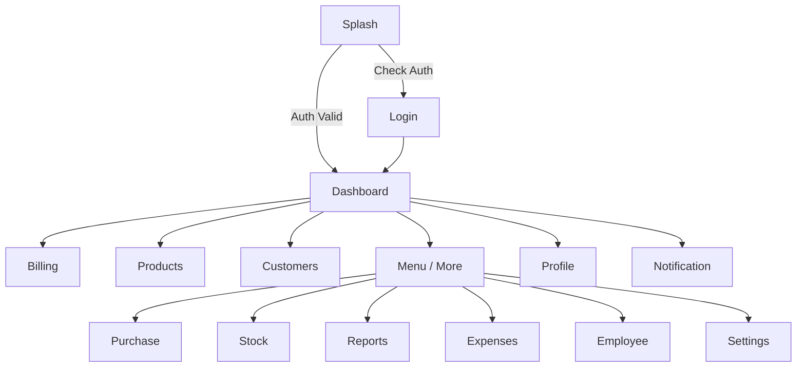

# Ramest Krishi Sewa Kendra - UI/UX Design System

This document outlines the complete UI/UX strategy for the application, ensuring a fast, professional, and intuitive experience tailored for agriculture store employees using modern Material 3 design principles.

## User Review Required
> [!IMPORTANT]
> Please review the textual wireframes and navigation flow. Ensure the "Billing" workflow matches your real-world shop operations. 
> Should the "Billing" screen be the default landing page for cashiers, while the "Dashboard" is the default for admins?

---

## 1. Color Palette (Agriculture Business Theme)
*   **Primary:** `Deep Green (#2E7D32)` - Represents agriculture, growth, and trust.
*   **Secondary:** `Amber (#FF8F00)` - Used for alerts (low stock, pending payments).
*   **Background:** `Surface Light (#FBFDF8)` - Soft off-white with a subtle green tint to reduce eye strain during long working hours.
*   **Surface:** `White (#FFFFFF)` - For cards, dialogs, and bottom sheets.
*   **Error:** `Crimson Red (#D32F2F)` - For overdue ledgers and critical errors.
*   **Text Primary:** `Dark Charcoal (#1E231F)` - For high contrast and legibility.

## 2. Typography
*   **Font Family:** `Inter` or `Roboto`. These fonts are highly legible on budget Android devices.
*   **Headlines:** Medium weight, used for screen titles and metric numbers.
*   **Body:** Regular weight, used for lists, tables, and product details.
*   **Numerals:** Tabular lining for numbers (so decimal points align perfectly in billing tables).

## 3. Component List (Material 3)
*   **Navigation:** Bottom Navigation Bar (Phones) / Navigation Rail (Tablets/Landscape).
*   **FAB (Floating Action Button):** Prominent large FABs for core actions like "New Sale".
*   **Chips:** Used heavily for fast filtering (e.g., filtering products by `Seeds`, `Fertilizers`, `Tools`).
*   **Bottom Sheets:** Used for quick data entry (e.g., taking payment, applying discounts) to keep the user in the context of the main screen.
*   **Snackbars:** Non-intrusive feedback for successful actions (e.g., "Invoice Saved Offline").

## 4. Navigation Flow

---

## 5. Textual Wireframes

### 5.1 Splash & Login
*   **Splash:** App Logo centered, "Ramest Krishi Sewa Kendra" branding, version number at bottom.
*   **Login:** Clean, professional surface. 
    *   Fields: Phone Number / User ID, Password/PIN.
    *   Button: Large `Login` button.
    *   *UX Note:* A 4-digit PIN login is faster for shop employees than typing a full password repeatedly.

### 5.2 Dashboard (Home)
*   **App Bar:** Profile Avatar (Left), "Ramest Krishi" Title, Sync Status Icon (Online/Offline) & Notification Bell (Right).
*   **Top Action:** Large prominent card/button spanning the width: **"⚡ Quick Billing"**.
*   **Metrics Grid (2x2):** 
    *   Today's Sales (₹)
    *   Pending Khata (₹) (Red if high)
    *   Low Stock Alerts (Warning Icon)
    *   Today's Expenses (₹)
*   **Recent Activity:** A short list of the last 3-5 sales with timestamp and amount.
*   **Bottom Nav:** Home | Billing | Customers | Products | Menu

### 5.3 Billing (POS - Core Fast Workflow)
*   **App Bar:** "New Sale".
*   **Search/Add Area:** Persistent search bar at top. Tapping it opens barcode scanner or keyboard.
*   **Cart List:** 
    *   Rows showing: Item Name, Price.
    *   Controls: `[-] [Quantity] [+]` stepper.
*   **Bottom Fixed Area:**
    *   Customer Selection: Dropdown/Button (Defaults to "Walk-in Customer").
    *   Calculations: Subtotal, Discount input, Grand Total.
    *   Action Button: Massive **"PAY ₹X,XXX"** button.
    *   *Flow:* Tapping Pay opens a Bottom Sheet to select payment method (Cash, UPI, Khata/Credit).

### 5.4 Customers (Khata / Ledger)
*   **List Screen:** Search bar. Filter Chips (`All`, `Due Balance`). 
    *   List Items: Avatar (Initials), Name, Phone, and Balance amount aligned to the right.
    *   FAB: `+ Add Customer`
*   **Customer Detail:** 
    *   Header: Name, Contact, Total Outstanding.
    *   Action Buttons: `Receive Payment`, `New Bill`.
    *   List: Ledger history (debits and credits with dates).

### 5.5 Products & Stock
*   **List Screen:** Search bar. Filter Chips for categories.
    *   List Items: Product Name, Category, Price, and Stock Count (Color-coded: Green=Good, Amber=Low, Red=Out).
    *   FAB: `+ Add Product`
*   **Stock Screen:** Dedicated screen for doing physical stock counts. Shows current expected stock vs. actual physical stock input fields.

### 5.6 Purchase & Expenses
*   **Purchase (Supplier Invoices):** List of incoming inventory from suppliers. Add new purchase invoice to increment stock and calculate Average Cost.
*   **Expenses:** Simple list. FAB to `+ Add Expense` (Tea, Transport, Rent). Date, Category, Amount.

### 5.7 Reports, Employee, & Settings
*   **Reports:** Date range picker. Visual charts for Sales vs. Expenses. Top selling products list. Export to PDF/Excel button.
*   **Employee:** List of staff members. Tap to edit roles (Admin, Cashier), reset PINs.
*   **Settings:** Printer setup (Bluetooth thermal printer pairing), Sync manually button, Branch information.

---

## 6. UX Improvements for Shop Employees

1.  **Scanner First:** The billing screen's search bar should have a dedicated barcode icon that immediately launches the camera scanner for ultra-fast product entry.
2.  **Number Pad Optimization:** Any text field requiring quantities or currency (e.g., discount, amount paid) must trigger the OS number pad, completely hiding alphabetical keys to prevent input errors.
3.  **Large Touch Targets:** Shop employees are moving fast. Buttons for `+` / `-` quantities and `Pay` must exceed standard Material sizing to be easily tappable without looking closely.
4.  **Visual Offline Indication:** A persistent but unobtrusive icon in the App Bar showing cloud status. If offline, the icon turns grey with a slash, but the app doesn't show blocking errors.
5.  **Role-Based Landing:** If the logged-in user is a "Cashier", the app should bypass the Dashboard and open directly into the **Billing** screen to save clicks. Admins land on the Dashboard to see metrics.
